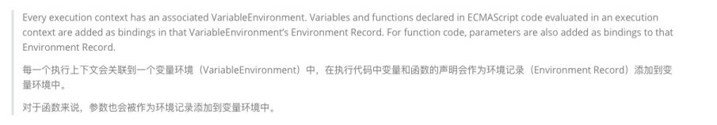
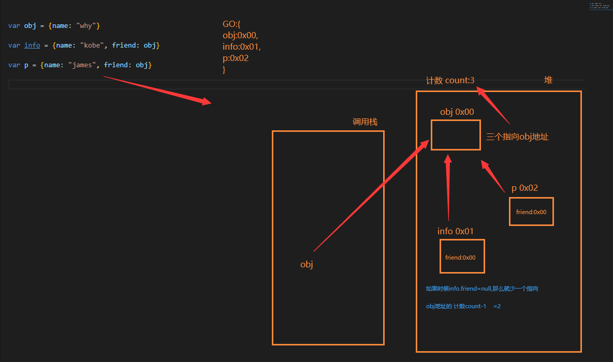

# JavaScript进阶


## 一、js执行过程与堆栈


## 二、环境变量与记录(ECMA版本规范)

+ 现在大部分还是再说早期ECMA的版本规范


+ 在最新的ECMA的版本规范中，对于一些词汇进行了修改：



> 整体来说VO对象(variable Object),也就是每次入栈创建的vo对象改了称呼为 "变量环境"


## 三、认识内存管理


**解释说明**：

不管什么样的编程语言，在**代码的执行过程中都是需要给它分配内存**的，不同的是**某些编程语言**需要我们**自己手动**

**的管理内存**，**某些编程语言**会可以**自动帮助我们管理内存**： 

+ 不管以什么样的方式来管理内存，**内存的管理都会有如下的生命周期**：
  + 第一步：分配申请你需要的内存（申请）；
  + 第二步：使用分配的内存（存放一些东西，比如对象等）；
  + 第三步：不需要使用时，对其进行释放；
+ **不同的编程语言对于第一步和第三步会有不同的实现：**
  + 手动管理内存：比如C、C++，包括早期的OC，都是需要手动来管理内存的申请和释放的（malloc和free函数）；
  + 自动管理内存：比如Java、JavaScript、Python、Swift、Dart等，它们有自动帮助我们管理内存；
  + 我们可以知道JavaScript通常情况下是不需要手动来管理的。


### 1、垃圾回收机制 GC (Garbage Collection)

#### 	1.1 引用计数算法

+ 在浏览器内存中的 **变量/函数** 会在自己的 **堆内存地址上** 身上做上标记点，也就是有几个指向他，直到没有指向他的，过段时间浏览器就会删除这块内存




+ 但是引用计数有 一个严重的弊端 **循环引用**，下图这样两个变量互相指定就不会被销毁


#### 	1.2 标记清除算法

+ 这个算法是设置一个根对象（root object），垃圾回收器会定期从这个根开始，找所有从根开始有引用到的对象，对于哪些没有引用到的对象，就认为是不可用的对象；

+ **JS引擎比较广泛的采用的就是标记清除算法**


## 四、函数

### 1、闭包

#### 	1.1 闭包的定义


**个人理解对闭包的定义：**

> 就是一个函数可以访问到外部的函数就称之为 **闭包**。

**闭包与普通函数的区别：**

> 当捕捉闭包的时候，它的 **自由变量** 会在捕捉时被确定，这样即使脱离了捕捉时的上下文，它也能照常运行；


### 2、 闭包的内存泄露

#### 	2.1 闭包内存泄漏的定义

> 指向闭包函数指向变量的堆内存地址所以内存越来越大


### 3、this绑定

#### 	3.1 默认绑定

+ 独立函数调用即为默认绑定

```js
// 默认绑定: 独立函数调用
// 1.案例一:
 function foo() {
   console.log(this); // window
 }

 foo();

// 2.案例二:
function foo1() {
  console.log(this); // window
}

function foo2() {
  console.log(this); // window
  foo1();
}

function foo3() {
  console.log(this); // window
  foo2();
}

foo3();

//3.案例三:
var obj = {
  name: "why",
  foo: function () {
    console.log(this);
  },
};

var bar = obj.foo;
bar(); // window
```

#### 	3.2 隐性绑定

+  object.fn() 这样fn会被隐形绑定this 为 object

```js
// 隐式绑定: object.fn()
// object对象会被js引擎绑定到fn函数的中this里面

// 1.案例一:
var obj = {
  name: "why",
  foo: foo
}

obj.foo() // obj对象

// 2.案例二:
var obj = {
  name: "why",
  eating: function() {
    console.log(this.name + "在吃东西")
  },
  running: function() {
    console.log(obj.name + "在跑步")
  }
}

obj.eating()//why
obj.running()//why

var fn = obj.eating
fn()//独立调用 window


// 3.案例三:
var obj1 = {
  name: "obj1",
  foo: function() {
    console.log(this)
  }
}

var obj2 = {
  name: "obj2",
  bar: obj1.foo
}

obj2.bar()//obj2
```

#### 	3.3 显性绑定

###### 		3.3.1 apply && call

+ 使用

```js
function foo() {
  console.log("函数被调用了", this)
}

//1.foo直接调用和call/apply调用的不同在于this绑定的不同
//foo直接调用指向的是全局对象(window)
foo()

var obj = {
  name: "obj"
}

//call/apply是可以指定this的绑定对象
foo.call(obj)//obj
foo.apply(obj) //obj
foo.apply("aaaa")//aaaa
```

+ 区别

```js
// 2.call和apply有什么区别?
function sum(num1, num2, num3) {
  console.log(num1 + num2 + num3, this)
}

sum.call("call", 20, 30, 40)
sum.apply("apply", [20, 30, 40])

// 3.call和apply在执行函数时,是可以明确的绑定this, 这个绑定规则称之为显示绑定
```

###### 		3.3.2 bind

+ 先接收为函数，后使用bind 绑定

```js
function foo() {
  console.log(this)
}

var newFoo = foo.bind("aaa")//aaa
```

###### 		3.3.3 new 绑定

```js
// 我们通过一个new关键字调用一个函数时(构造器), 这个时候this是在调用这个构造器时创建出来的对象
// this = 创建出来的对象
// 这个绑定过程就是new 绑定

function Person(name, age) {
  this.name = name;
  this.age = age;
}

var p1 = new Person("why", 18);
console.log(p1.name, p1.age);//why 18
console.log(p1);//Person {name: 'why', age: 18}

var p2 = new Person("kobe", 30);
console.log(p2.name, p2.age);//kobe 30
```

#### 	3.4 this绑定规则优先级

> new绑定 > 显示绑定(apply/call/bind) > 隐式绑定(obj.foo()) > 默认绑定(独立函数调用)

### 4、call，apply，bind函数实现

#### 4.1 call 函数实现

```js

```

#### 4.2 apply 函数实现

```js

```

#### 4.2 bind函数实现

```js

```

### 5、认识arguments

#### 5.1 arguments定义

+ **arguments** 是一个 对应于 **传递给函数的参数** 的 **类数组(array-like)对象**。
+ array-like意味着它不是一个数组类型，而是一个对象类型：
  + 但是它却拥有数组的一些特性，比如说length，比如可以通过index索引来访问；
  + 但是它却没有数组的一些方法，比如forEach、map等；

#### 5.2 arguments基本使用

```js
function foo(num1, num2, num3) {
  // 类数组对象中(长的像是一个数组, 本质上是一个对象): arguments
  console.log(arguments);

  // 常见的对arguments的操作是三个
  // 1.获取参数的长度
  console.log(arguments.length);

  // 2.根据索引值获取某一个参数
  console.log(arguments[2]);
  console.log(arguments[3]);
  console.log(arguments[4]);

  // 3.callee获取当前arguments所在的函数
  console.log(arguments.callee);
  // arguments.callee()//如果这样调用本身函数那么就会形成无线递归调用，会把浏览器累的骂娘的
}

foo(10, 20, 30, 40, 50);

```

#### 5.2 arguments转成Array

```js
function foo(num1, num2) {
  // 1.自己遍历
  // var newArr = []
  // for (var i = 0; i < arguments.length; i++) {
  //   newArr.push(arguments[i] * 10)
  // }
  // console.log(newArr)

  // 2.arguments转成array类型
  // 2.1.自己遍历arguments中所有的元素

  // 2.2.Array.prototype.slice将arguments转成array
  var newArr2 = Array.prototype.slice.call(arguments)
  console.log(newArr2)

  var newArr3 = [].slice.call(arguments)
  console.log(newArr3)

  // 2.3.ES6的语法
  var newArr4 = Array.from(arguments)
  console.log(newArr4)
  var newArr5 = [...arguments]
  console.log(newArr5)
}

foo(10, 20, 30, 40, 50)

// 额外补充的知识点: Array中的slice实现
// Array.prototype.hyslice = function(start, end) {
//   var arr = this
//   start = start || 0
//   end = end || arr.length
//   var newArray = []
//   for (var i = start; i < end; i++) {
//     newArray.push(arr[i])
//   }
//   return newArray
// }

// var newArray = Array.prototype.hyslice.call(["aaaa", "bbb", "cccc"], 1, 3)
// console.log(newArray)

// var names = ["aaa", "bbb", "ccc", "ddd"]
// names.slice(1, 3)


```

